# Coordinated 12-DOF Quadruped Robot with Blynk IoT Interface

A professional-grade quadruped (4-legged) robot platform utilizing a **12 Degree of Freedom (DOF)** mechanical configuration. Designed with an embedded system that distributes computational load, the robot features a Wi-Fi-enabled microcontroller (**ESP32** or **ESP8266**) for logical coordination and IoT communications, and an **Adafruit PCA9685** 16-channel 12-bit PWM driver for precise multi-servo actuation. 

The robot is controlled in real-time via the **Blynk IoT** mobile application, executing both static posturing and dynamic locomotion (diagonal gait) through an open-loop, time-synchronized control architecture.

---

## 🎥 Full System Demonstration

Below is a comprehensive video demonstration of the 12-DOF Quadruped Robot executing various postures, gait transitions, and active movement routines, managed in real-time using the Blynk IoT mobile dashboard:

<p align="center">
  <video src="Demo/robot_demonstration.mp4" width="100%" controls></video>
</p>

---

## 📸 Pose & Maneuver Showcase

Below are the operational poses and mechanical configurations executed by the robot, displaying its structural integrity and kinematic capabilities along with their respective demonstration clips:

| 🦾 Stand Pose (Normal) | 🧍 Erect Stand Pose | 🚨 Alert (Ready) Pose |
| :---: | :---: | :---: |
| 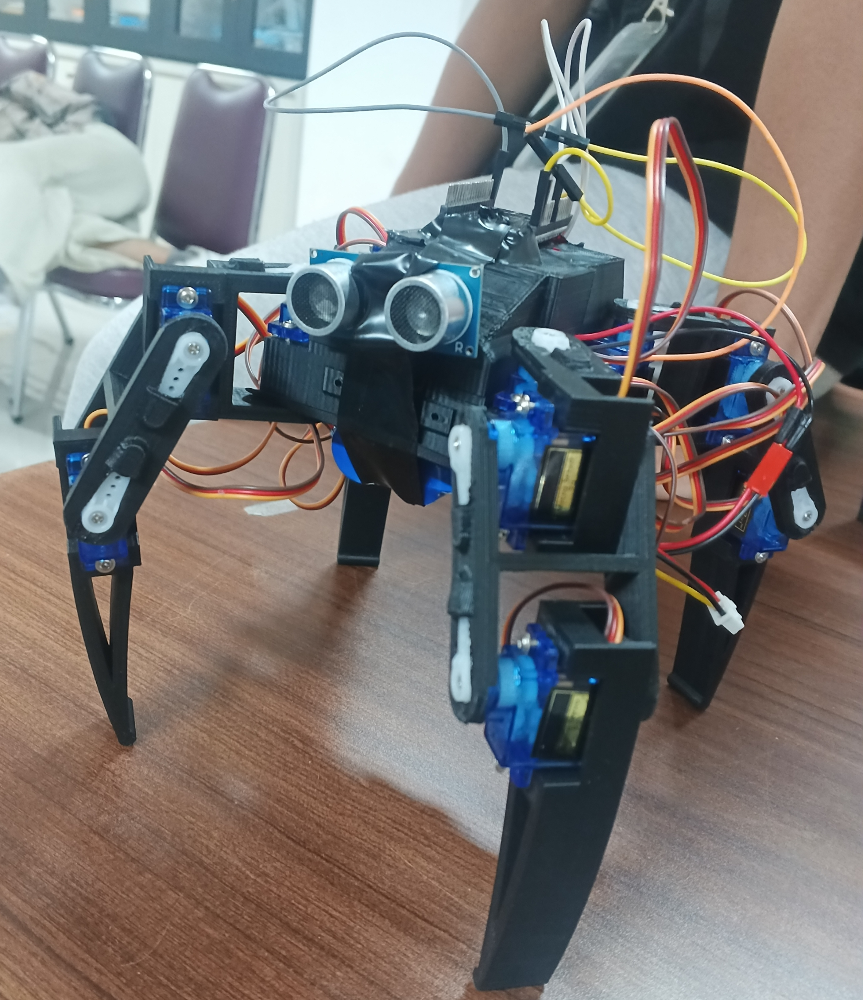 | 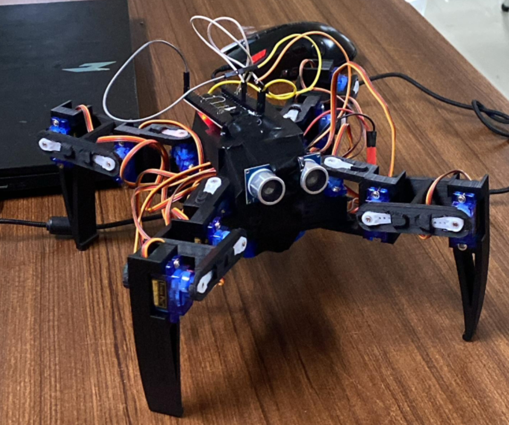 | 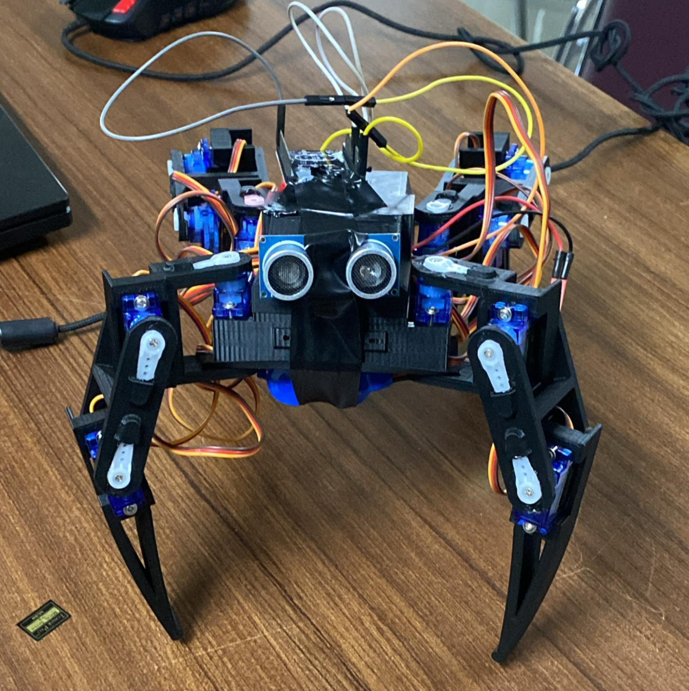 |
| <video src="Demo/jongkok_berdiri.mp4" width="220" controls></video> | <video src="Demo/jongkok_berdiri_top.mp4" width="220" controls></video> | <video src="Demo/siaga.mp4" width="220" controls></video> |
| **V1 (HIGH)**: Default stance. | **Default Setup**: High-extension. | **V7 (HIGH)**: Prepared for locomotion. |

| 💤 Sleep / Rest Pose | 🙇 Bow / Nudge Pose | 👋 Wave Pose |
| :---: | :---: | :---: |
| 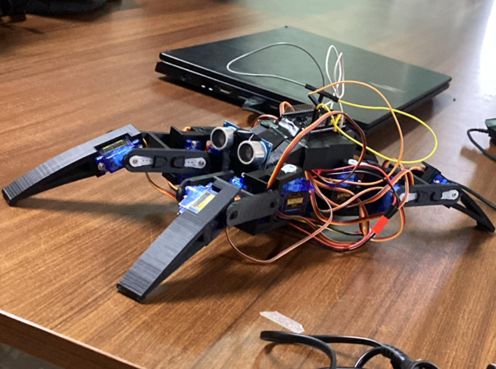 | 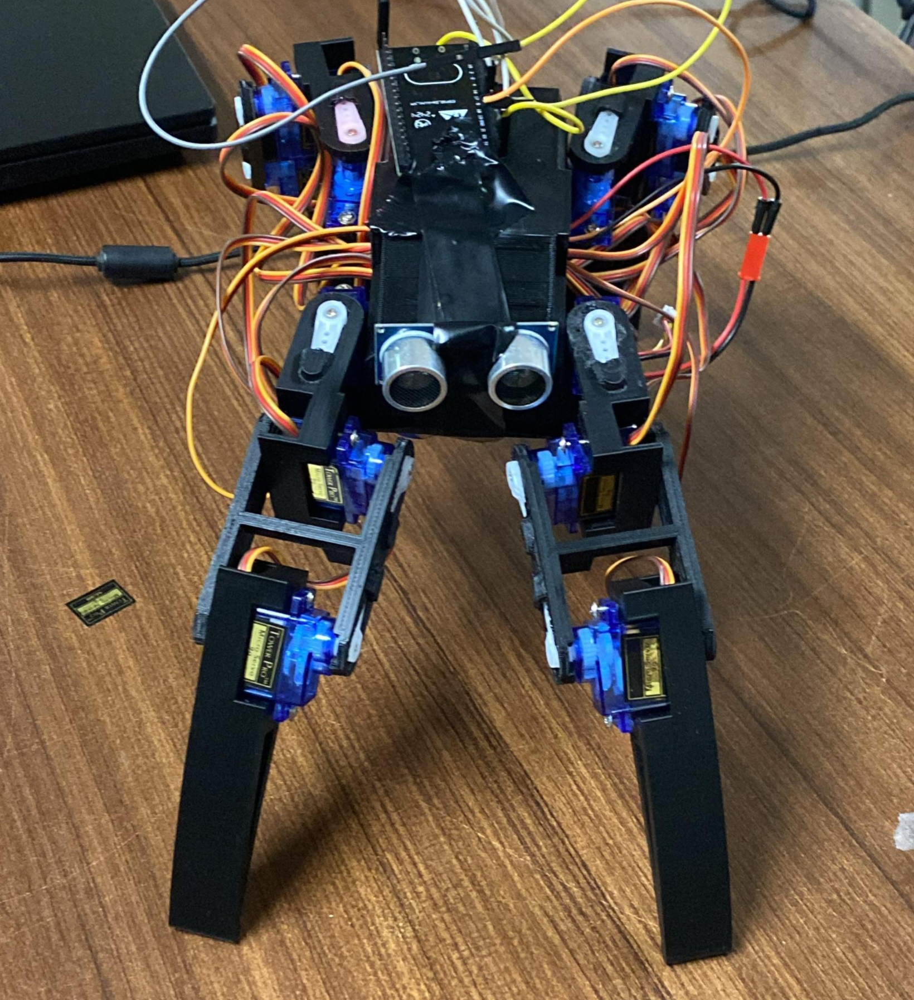 | 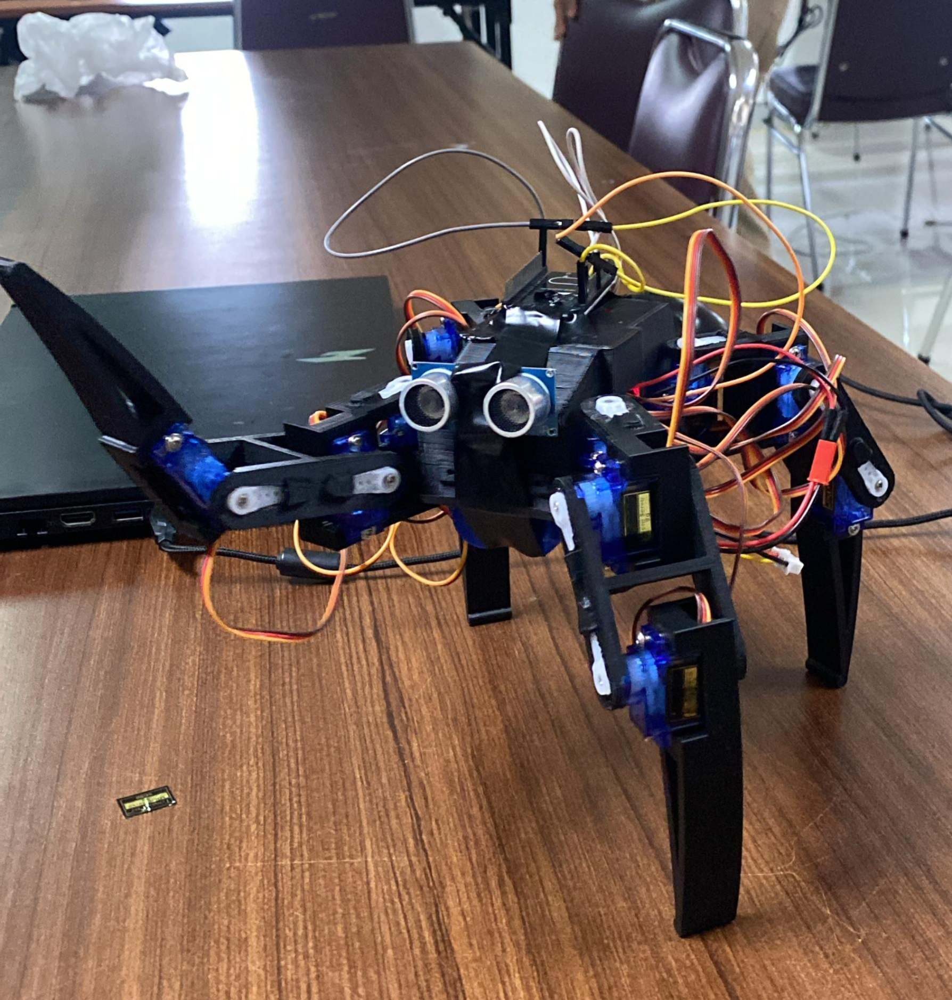 |
| <video src="Demo/tiduran.mp4" width="220" controls></video> | <video src="Demo/nungging.mp4" width="220" controls></video> | <video src="Demo/Melambai.mp4" width="220" controls></video> |
| **V12 (HIGH)**: Low-power state, joints folded. | **V8 (HIGH)**: Low front, high rear. | **V13 (HIGH)**: Front-right leg gesture. |

| 👈 Lean Left Pose | 👉 Lean Right Pose | 🔄 Rotate / Turn Pose |
| :---: | :---: | :---: |
| 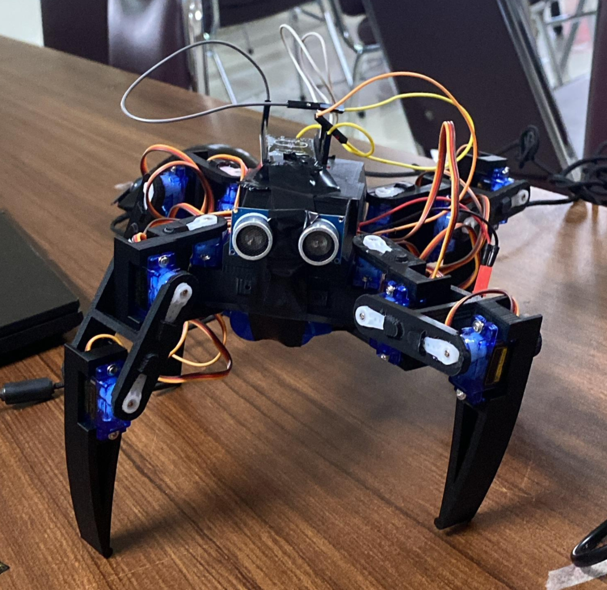 | 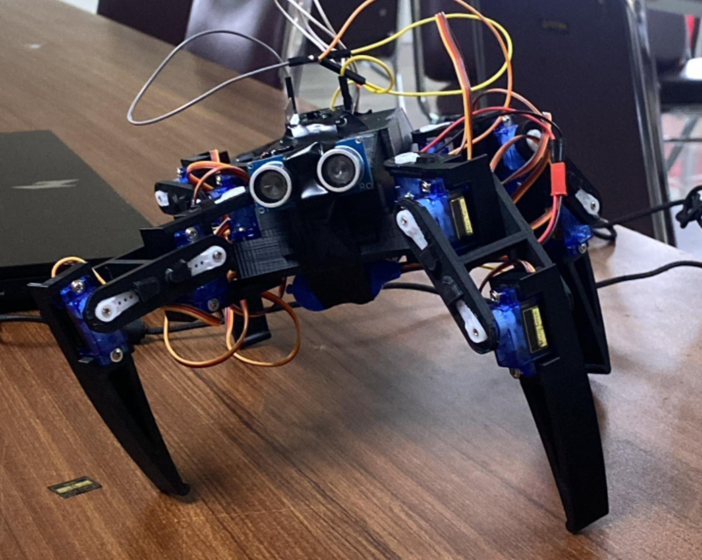 | 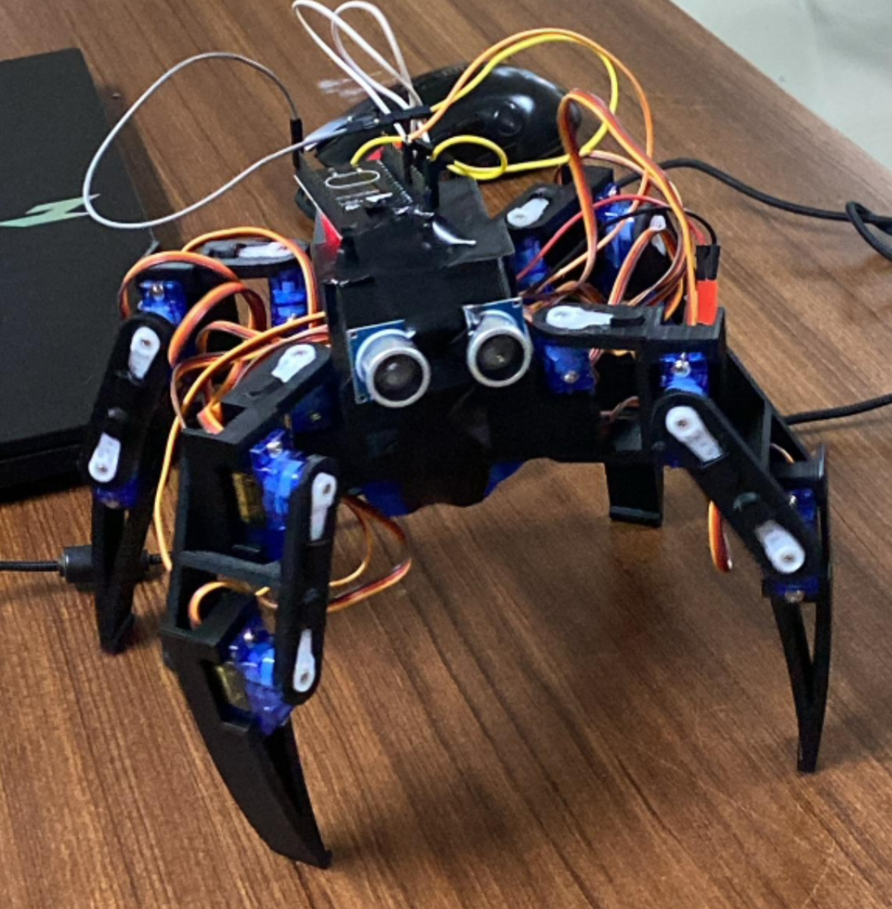 |
| <video src="Demo/miring_kiri.mp4" width="220" controls></video> | <video src="Demo/miring_kanan.mp4" width="220" controls></video> | <video src="Demo/dance.mp4" width="220" controls></video> |
| **V9 (HIGH)**: Roll movement left. | **V10 (HIGH)**: Roll movement right. | **V3 / V6 (PUSH)**: Rotational gait & dance. |

---

## 🚶 Locomotion & Dynamic Movement Guide

This section outlines the locomotion patterns and sequential execution phases of the quadruped robot. The robot utilizes a coordinated **Diagonal/Trot Gait** for linear movement and synchronized hip-turning actions for angular rotation.

### 1. Forward Locomotion (Maju)
The forward gait is executed as a synchronized diagonal gait, where diagonal pairs of legs lift and swing forward together while the other pair supports the body and pushes it backward relative to the chassis, resulting in forward momentum.

* **Demonstration Video**:
  <p align="center">
    <video src="Demo/maju.mp4" width="600" controls></video>
  </p>

* **Gait Phase Progression**:
  | 1️⃣ Phase 1: RF & LR Lift & Swing | 2️⃣ Phase 2: LF & RR Lift & Swing |
  | :---: | :---: |
  | 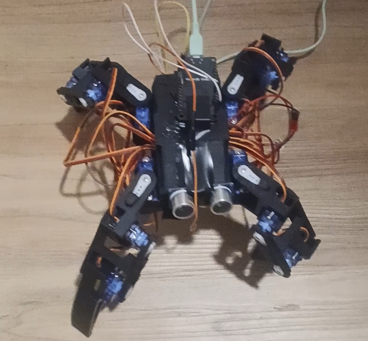 | 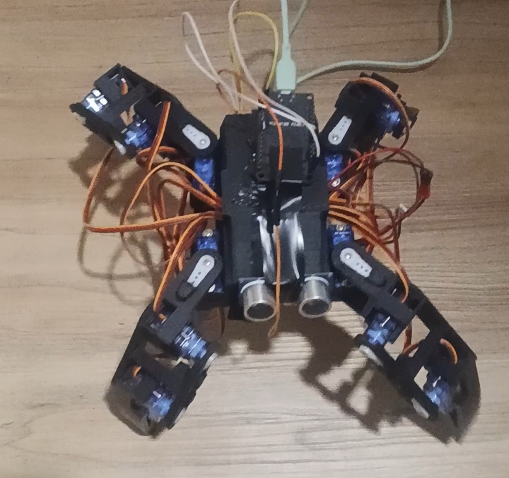 |
  | Diagonal Right-Front (RF) and Left-Rear (LR) legs swing forward. | Diagonal Left-Front (LF) and Right-Rear (RR) legs swing forward. |

---

### 2. Backward Locomotion (Mundur)
Similar to forward walking, the backward gait alternates diagonal leg pairs but reverses the direction of the coxa sweep angles to push the chassis backward.

* **Demonstration Video**:
  <p align="center">
    <video src="Demo/mundur.mp4" width="600" controls></video>
  </p>

* **Gait Phase Progression**:
  | 1️⃣ Phase 1: RF & LR Lift & Sweep Back | 2️⃣ Phase 2: LF & RR Lift & Sweep Back |
  | :---: | :---: |
  | 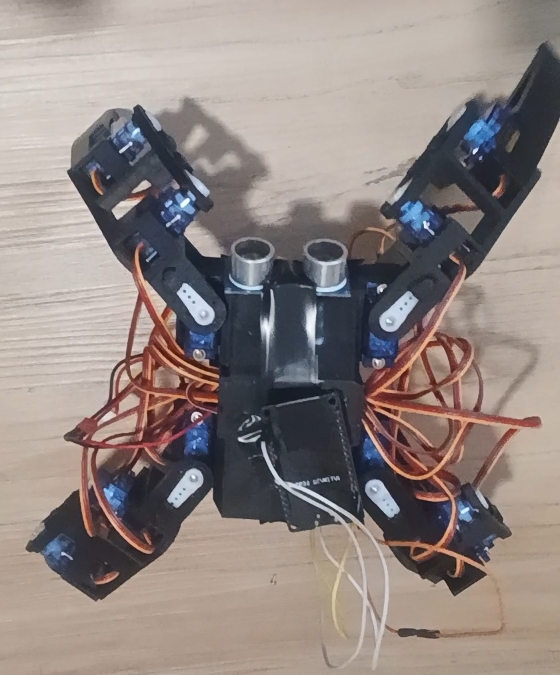 | 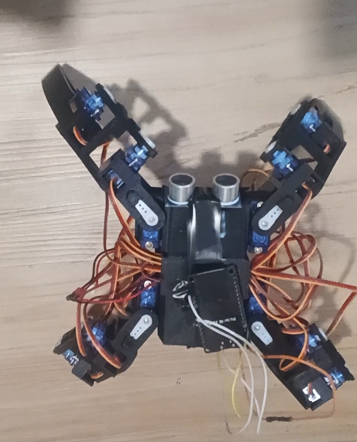 |
  | Diagonal Right-Front (RF) and Left-Rear (LR) legs lift and sweep backward. | Diagonal Left-Front (LF) and Right-Rear (RR) legs lift and sweep backward. |

---

### 3. Left Turn Maneuver (Belok Kiri)
To turn left, the robot adjusts the yaw angle using its Coxa joints. The diagonal legs lift and sweep outwards/inwards asymmetrically to generate a counter-clockwise torque.

* **Demonstration Video**:
  <p align="center">
    <video src="Demo/belok_kiri.mp4" width="600" controls></video>
  </p>

* **Step Phase Progression**:
  | 1️⃣ Phase 1: Swing Left Alignment | 2️⃣ Phase 2: Pivot & Ground Sweep |
  | :---: | :---: |
  | 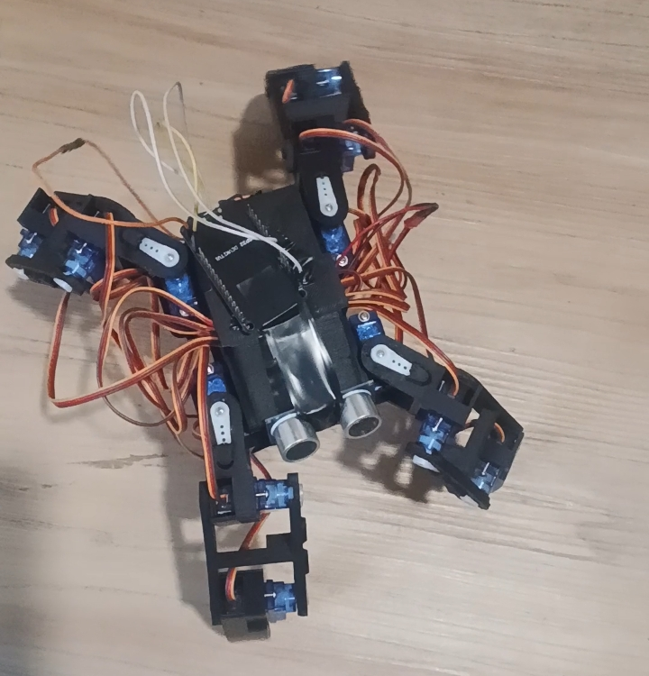 | 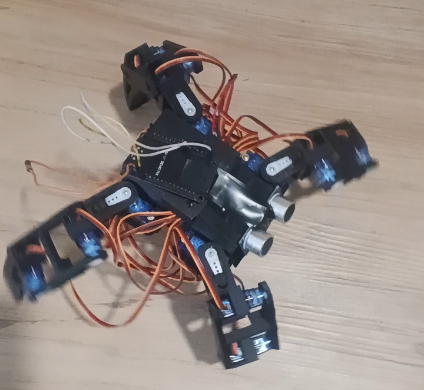 |
  | First diagonal pair lifts and pivots outwards towards the left. | Second diagonal pair lifts, matching orientation to complete the pivot. |

---

### 4. Right Turn Maneuver (Belok Kanan)
The right turn reverses the pivot dynamics of the left turn, generating clockwise yaw torque.

* **Demonstration Video**:
  <p align="center">
    <video src="Demo/belok_kanan.mp4" width="600" controls></video>
  </p>

* **Step Phase Progression**:
  | 1️⃣ Phase 1: Swing Right Alignment | 2️⃣ Phase 2: Pivot & Ground Sweep |
  | :---: | :---: |
  | 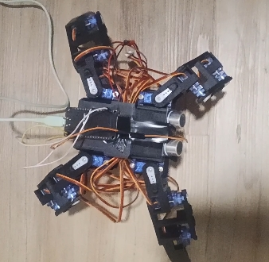 | 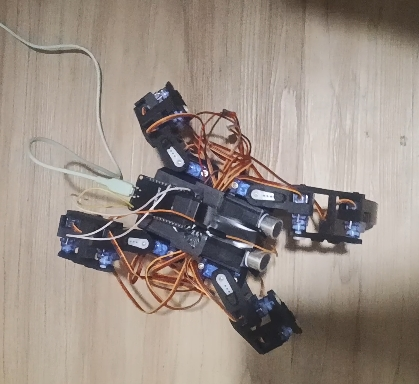 |
  | First diagonal pair lifts and pivots outwards towards the right. | Second diagonal pair lifts, matching orientation to complete the pivot. |

---

### 5. Coordinated Dance Routine (Dance Mode)
The dance routine showcases the robot's ability to smoothly shift its center of mass across all axes (Roll and Pitch) sequentially.

* **Demonstration Video**:
  <p align="center">
    <video src="Demo/dance.mp4" width="600" controls></video>
  </p>

* **Chassis Orientation Stages**:
  | 1️⃣ Step 1: Lateral Roll Shift | 2️⃣ Step 2: Pitch Forward Shift | 3️⃣ Step 3: Pitch Backward Shift |
  | :---: | :---: | :---: |
  | 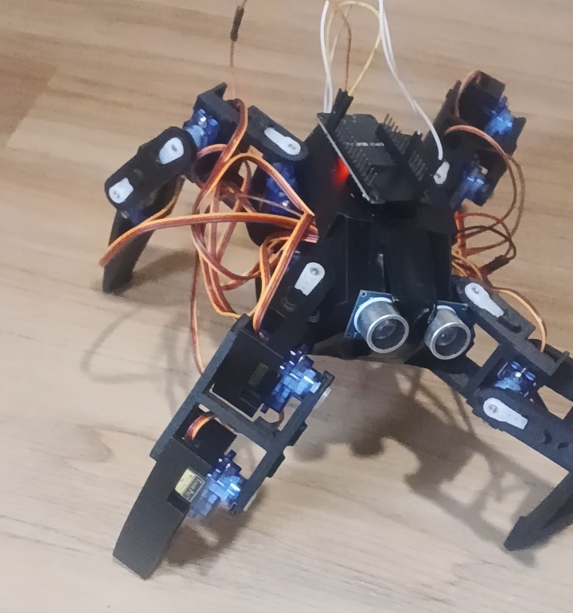 | 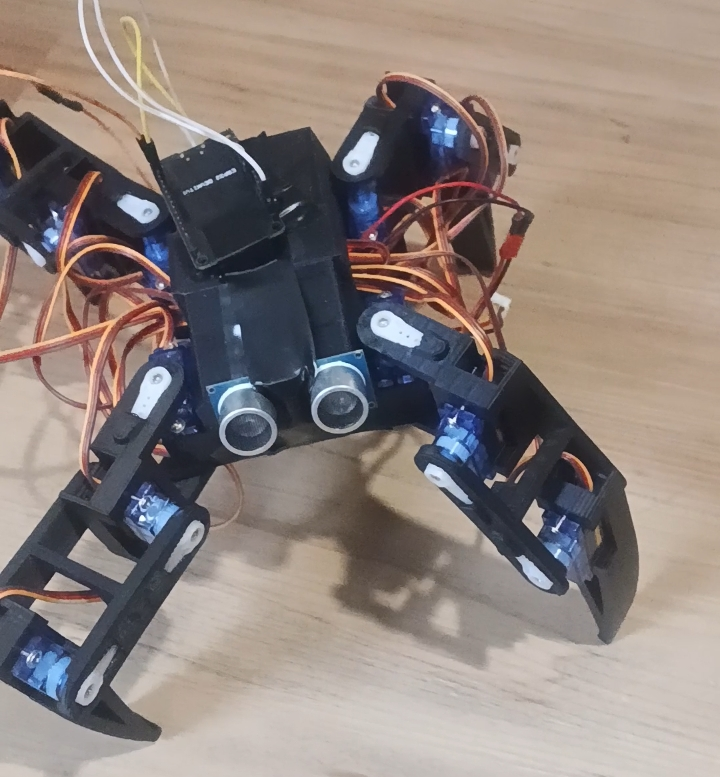 | 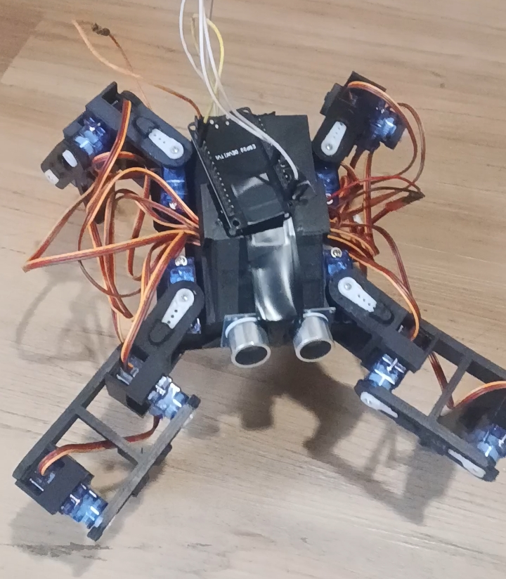 |
  | Alternating Roll shifts (Left and Right tilts). | Tilting forward by lowering front limbs. | Tilting backward by lowering rear limbs. |

---

## 🛠️ System Architecture & Specifications

The robot distributes workload between logical control and actuation, minimizing latency and preventing CPU overhead during coordinated motion.

```
       [ Blynk Mobile App ]
                │
                ▼ (Wi-Fi 2.4GHz)
      [ ESP32 / ESP8266 MCU ]  <--- Powered by USB/5S (Logic)
                │
                ▼ (I2C Bus: SDA/SCL)
    [ PCA9685 12-Bit PWM Driver ] <--- Powered by 7.4V Battery (Inductive Load)
                │
                ├─► 3 Servos (Coxa, Femur, Tibia) ──► Right Front (RF) Leg
                ├─► 3 Servos (Coxa, Femur, Tibia) ──► Left Front (LF) Leg
                ├─► 3 Servos (Coxa, Femur, Tibia) ──► Right Rear (RR) Leg
                └─► 3 Servos (Coxa, Femur, Tibia) ──► Left Rear (LR) Leg
```

### 1. Hardware Specifications
* **MCU Support**: 
  * **ESP32** (e.g., ESP32 DevKit V1) - Integrated dual-core Xtensa 32-bit MCU with 2.4 GHz Wi-Fi.
  * **ESP8266** (e.g., NodeMCU V3) - Single-core Tensilica 32-bit MCU with 2.4 GHz Wi-Fi.
* **PWM Driver**: Adafruit PCA9685 (16-channel, 12-bit resolution PWM, controlled via I2C at address `0x40`).
* **Actuators**: 12x Micro Servos (SG90 / MG90S metal gear recommended for Femur/Tibia due to torque load).
* **Power Source**: 7.4V DC Lithium battery (2S Li-ion/Li-Po) to supply high current demands of the servo array.
* **Chassis**: Custom 3D-printed PLA/PETG structural elements.

---

## 🔌 Wiring & Pinout Guide

### 1. Logic Interconnections (I2C Bus)
The PCA9685 communicates with the MCU using the standard I2C interface. Connect SDA and SCL pins based on your selected MCU:

| PCA9685 Pin | ESP32 Pin | ESP8266 (NodeMCU) Pin | Description |
| :---: | :---: | :---: | :---: |
| **SDA** | **GPIO 18** | **D4 (GPIO 2)** | I2C Data Line |
| **SCL** | **GPIO 23** | **D5 (GPIO 14)** | I2C Clock Line |
| **VCC** | **3.3V** | **3.3V** | Logic Power (MCU side) |
| **GND** | **GND** | **GND** | Common Ground Reference |

### 2. Servo Actuator Mapping (PCA9685 Output Channels)
To maintain alignment in the firmware, plug the servos into the PCA9685 channels in the exact order detailed below:

```
                  ┌────────────────────────┐
                  │       FRONT SIDE       │
                  │                        │
  [LF Leg]        │                        │        [RF Leg]
  Coxa: Ch 0 ────►│ (LF)              (RF) │◄──── Coxa: Ch 4
  Femur: Ch 1 ───►│                        │◄──── Femur: Ch 5
  Tibia: Ch 2 ───►│                        │◄──── Tibia: Ch 6
                  │                        │
                  │                        │
  [LR Leg]        │                        │        [RR Leg]
  Coxa: Ch 8 ────►│ (LR)              (RR) │◄──── Coxa: Ch 12
  Femur: Ch 9 ───►│                        │◄──── Femur: Ch 13
  Tibia: Ch 10 ──►│                        │◄──── Tibia: Ch 14
                  │                        │
                  └────────────────────────┘
```

| Leg Designation | Coxa (Hip) Channel | Femur (Knee) Channel | Tibia (Ankle) Channel |
| :--- | :---: | :---: | :---: |
| **Left Front (LF)** | `0` | `1` | `2` |
| **Right Front (RF)** | `4` | `5` | `6` |
| **Left Rear (LR)** | `8` | `9` | `10` |
| **Right Rear (RR)** | `12` | `13` | `14` |

> [!WARNING]
> Do **NOT** power the PCA9685 servo terminals (V+ and GND screw terminals) using the MCU's 3.3V/5V pins. The 12 servos can pull peak currents exceeding 2.0A, which will instantly damage or trigger brownout resets on the microcontroller. Always use an external 7.4V battery connected directly to the PCA9685 power input terminals.

---

## 📱 Blynk IoT Virtual Pin Mapping

The robot utilizes Virtual Pins (V1 - V13) to receive commands from the Blynk dashboard. 

| Virtual Pin | Dashboard Widget | Mode | System Action / Triggered Function |
| :---: | :--- | :---: | :--- |
| **V1** | Stand / Lower Switch | Switch | Toggles stance height between **Stand** (1) and **Lower** (0). |
| **V2** | Forward Button | Push | Executes the coordinated diagonal forward walking gait. |
| **V3** | Turn Left Button | Push | Executes rotational steering to the left. |
| **V4** | Standby Lock | Switch | **System Lock (E-Stop)**: Disables all inputs, resets flags, locks position. |
| **V5** | Backward Button | Push | Executes coordinated diagonal backward walking gait. |
| **V6** | Turn Right Button | Push | Executes rotational steering to the right. |
| **V7** | Alert / Siaga Switch | Switch | Transitions into an outer-stance alert position ready for movement. |
| **V8** | Bow / Sujud Switch | Switch | Depresses front legs while raising the rear legs. |
| **V9** | Lean Left Switch | Switch | Shifts the robot's center of mass laterally to the left. |
| **V10** | Lean Right Switch | Switch | Shifts the robot's center of mass laterally to the right. |
| **V11** | Dance Mode Switch | Switch | Initiates an automated movement routine (dance sequence). |
| **V12** | Sleep Stance Switch | Switch | Folds all joint limbs flat (resting/low-stress position). |
| **V13** | Wave Gesture Switch | Switch | Wavy gesture using the Front-Right (RF) leg. |

---

## 🔧 Assembly & Calibration Instructions

### 1. Mechanical Balance & Center of Mass (CoM)
* **Chassis Distribution**: Mount the ESP32 and PCA9685 modules directly in the center of the main body chassis to guarantee even weight distribution across all four legs.
* **Battery Placement**: Anchor the heavy 7.4V battery pack beneath the main chassis plate. This lowers the Center of Gravity (CoG), preventing the robot from tipping over during dynamic gait cycles.

### 2. Physical & Software Calibration
Before writing final angles, calibrate the servo horns to ensure structural symmetry:
1. Burn a sketch initializing all PCA9685 channels to a default $90^\circ$ signal.
2. Manually press the physical servo horns onto the gears such that:
   * **Coxa** joints align perpendicular ($90^\circ$) to the main chassis axis.
   * **Femur** joints sit parallel to the horizontal plane.
   * **Tibia** joints stand perpendicular to the femur.
3. Secure the horns with screws.
4. Fine-tune the initial positions in the firmware (`BERDIRI_COXA`, `BERDIRI_FEMUR`, `BERDIRI_TIBIA`) to compensate for minor mechanical alignment offsets.

---

## 🚀 Uploading & Running the Firmware

### Library Dependencies
Ensure you have installed the following libraries via the Arduino Library Manager:
* `Blynk` (by Volodymyr Shymanskyy)
* `Adafruit PWM Servo Driver Library` (by Adafruit)

### Configuration
1. Open the code matching your hardware:
   * Use [Blynk_Quadrupet_Spider_ESP32.ino](file:///mnt/SStorage/Materi-Kuliah/KP/Quadrupped-Robot/Blynk_Quadrupet_Spider_ESP32/Blynk_Quadrupet_Spider_ESP32.ino) for ESP32.
   * Use [Blynk_Quadrupet_Spider_ESP8266.ino](file:///mnt/SStorage/Materi-Kuliah/KP/Quadrupped-Robot/Blynk_Quadrupet_Spider_ESP8266/Blynk_Quadrupet_Spider_ESP8266.ino) for ESP8266.
2. Insert your Blynk Template credentials at the top of the file:
   ```cpp
   #define BLYNK_TEMPLATE_ID "YOUR_TEMPLATE_ID"
   #define BLYNK_TEMPLATE_NAME "YOUR_TEMPLATE_NAME"
   #define BLYNK_AUTH_TOKEN "YOUR_AUTH_TOKEN"
   ```
3. Update Wi-Fi network parameters:
   ```cpp
   char ssid[] = "YOUR_WIFI_SSID";
   char pass[] = "YOUR_WIFI_PASSWORD";
   ```
4. Set the target board in Arduino IDE (`Tools -> Board -> ESP32 Arduino` or `ESP8266 Boards`) and upload the sketch.

---

## 🛡️ Operational Safety & Maintenance

### 1. Thermal Management (Servo Duty Limit)
Continuous hold torque draws significant current and generates heat inside the micro servos.
* **Operational Limit**: Restrict active runs to **15-20 minutes** at a time.
* **Cooling Action**: Turn off the power immediately if the servo casings feel hot to the touch. Let them cool down completely before restarting.

### 2. Startup and Shutdown Protocols
To protect the gear train from high-torque mechanical shock (jerk) when powering up:
1. **Startup**: Place the robot on a flat, unobstructed surface with legs folded symmetrically. Connect the power. The MCU will perform soft-start sweeps to initial angles.
2. **Shutdown**: Through the Blynk app, command the robot into the **Sleep Stance (V12)** to lower the chassis flat to the ground. This unloads gravity-induced forces from the joints. Disconnect the 7.4V battery pack.

---

## 🔍 Troubleshooting Guide

| Issue | Root Cause | Corrective Action |
| :--- | :--- | :--- |
| **Robot does not respond to Blynk commands.** | ESP32 failed to associate with local Wi-Fi, or Blynk authentication token is incorrect. | Open Serial Monitor at `115200` baud. Verify connection status. Check Blynk token validity and app online indicator. |
| **Servos jitter violently under load.** | Voltage drop/instability. External battery voltage has dropped below the threshold required to drive 12 servos ($<6.0\text{V}$). | Recharge the 7.4V Lithium battery pack using a balance charger. Ensure connection lines use adequate wire gauge. |
| **MCU resets spontaneously during walk cycle.** | High peak currents drawn by multiple servos exceed battery discharge rate or trigger local regulator brownout. | Install a large decoupling capacitor (e.g., $1000\mu\text{F}$, $10\text{V}$ or higher) across the V+ and GND terminals of the PCA9685. |
| **Gait is asymmetric or robot walks crooked.** | Physical displacement of a servo horn, stripped gears, or uncalibrated software array offset. | Visually inspect the 3D-printed joints. Readjust the physical servo horn at $90^\circ$ or update the angle array values in the code. |

---

## 👨‍💻 Credits & Creator Statement

This robot is designed, assembled, wired, calibrated, and programmed **exclusively** by the creator. All components, mechanical linkages, power regulation, and firmware integrations were compiled and executed independently as a single-developer robotics engineering project.
